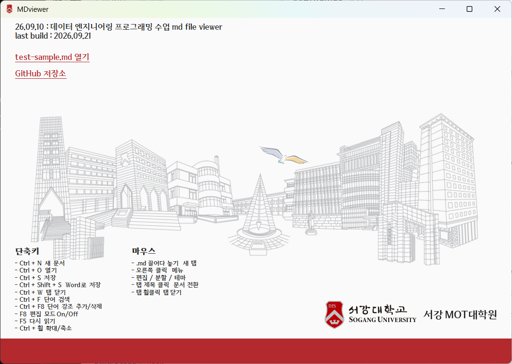

# MDviewer

서강대학교 MOT대학원 데이터 엔지니어링 프로그래밍 수업용 Windows Markdown 뷰어 & 편집 프로그램

https://github.com/JeBum/MDviewer

<p align="center">
  
</p>

MDviewer는 Windows에서 Markdown 문서를 편집하고, 실시간으로 보기 좋게 렌더링하며, Word 문서로 내보낼 수 있는 가벼운 데스크톱 앱입니다.

- 편집기와 미리보기를 세로·가로로 분할하고 1~3단으로 읽기
- 표, 수식, 이미지, 링크, 체크박스를 포함한 Markdown 문서 렌더링
- 검색, 선택 단어 강조, 테마 변경, `.md` 파일 드래그 앤 드롭
- 화면에 표시된 문서를 `.docx` 파일로 저장

### 화면 미리보기

| 편집·검색 | 표 보기 |
|---|---|
|  |  |

| 다단 보기 | 수식 보기 |
|---|---|
|  |  |

## 요구 사항

- Windows 10/11 x64
- 개발: .NET 8 SDK
- 실행: WebView2 (Windows 10/11에 보통 포함)

## 빌드

```bat
build.bat
```

결과: `publish\MDviewer.exe`

설치본:

```bat
make_setup.bat
```

결과: `installer\MDviewerSetup.exe`

<a id="file-association"></a>
## `.md` 파일 연결 프로그램 등록

설치 프로그램(`installer\MDviewerSetup.exe`)을 실행할 때 **.md file association** 항목을 선택하면 Windows 탐색기에서 `.md` 파일을 더블 클릭해 MDviewer로 열 수 있습니다. 설치 후에도 등록하려면 다음 순서로 설정합니다.

1. .md 파일을 마우스 오른쪽 버튼으로 클릭합니다.
2. **연결 프로그램 → 다른 앱 선택**을 클릭합니다.
3. **이 PC에서 앱 선택**을 클릭하고 설치 폴더의 `MDviewer.exe`를 선택합니다.
4. **항상 이 앱을 사용하여 .md 파일 열기**를 체크합니다.

## 샘플 문서

홈 화면의 **test-sample.md 열기**를 클릭하면 실행 파일과 같은 폴더에 샘플 파일을 생성하고 VIEW로 엽니다. 파일이 이미 있으면 내용과 수정 시각을 그대로 유지한 채 해당 파일을 엽니다. 샘플은 실행 파일에 내장되어 별도로 다운로드할 필요가 없습니다.

홈 화면의 **GitHub 저장소**를 클릭하면 프로젝트 저장소를 기본 웹 브라우저로 엽니다.

홈 화면의 **md 파일 연결프로그램 등록**을 클릭하면 현재 실행 파일을 `.md`/`.markdown` 연결 프로그램으로 등록하고, 그림 안내와 함께 Windows 기본 앱 설정 창을 열 수 있습니다.

## 단축키 (Keyboard Shortcuts)

| 단축키 | 동작 |
|---|---|
| `Ctrl + N` | 새 문서 |
| `Ctrl + O` | 열기 |
| `Ctrl + S` | 저장 |
| `Ctrl + Shift + S` | Word로 저장 (.docx) |
| `Ctrl + W` | 탭 닫기 |
| `Ctrl + F` | 단어 검색 |
| `Shift + F8` | 선택 단어 강조 (강조 키워드 등록) |
| `F5` | 다시 읽기 (새로고침) |
| `Ctrl + 휠` | 확대 / 축소 |

## 마우스 조작 (Mouse Actions)

| 마우스 조작 | 동작 |
|---|---|
| `.md` 파일 끌어다 놓기 | 새 탭으로 문서 열기 |
| 오른쪽 클릭 | 메뉴 (컨텍스트 메뉴 호출) |
| 탭 제목 클릭 | 해당 문서로 전환 |
| 탭 휠클릭 (가운데 버튼) | 해당 탭 닫기 |

## 우클릭 메뉴 (Context Menu)

- **New**: 새 문서 생성
- **Open**: 파일 열기
- **Save**: 현재 문서 저장
- **Word로 저장**: 편집·분할을 해제해 단일 VIEW 모드로 전환한 뒤 화면에 렌더링된 본문을 `.docx`로 저장. 제목·강조·표·목록·링크·글꼴·색상을 반영하며 본문과 표는 Word에서 편집 가능. 이미지와 수식은 화면에 표시된 모습으로 문서에 내장. 메뉴와 `Ctrl + Shift + S`에 동일하게 적용되며, 저장을 취소해도 VIEW 모드 유지.
- **닫기**: 현재 활성 탭 닫기
- **전체 닫기**: 모든 탭 닫기
- **다른 문서 닫기**: 현재 탭 외 나머지 탭 닫기
- **검색 (Ctrl+F)**: 단어 검색
- **강조 키워드 (Shift+F8)**: 탭 하단 강조 키워드 입력창 표시/숨김
- **편집 모드**: 소스 편집기 활성화/비활성화
- **세로 분할**: 편집기와 미리보기를 좌우로 분할
- **가로 분할**: 편집기와 미리보기를 상하로 분할
- **다단 보기**: 1단 (기본), 2단, 3단, 자동 (너비 맞춤)
- **테마**: 서강, 알바트로스, 블루스카이, 포레스트 그린 테마 전환

## 주요 기능

- **다단 보기 (Multi-Column View)**: 우클릭 메뉴의 **다단 보기**에서 2단, 3단, 자동(너비 맞춤) 또는 기본 1단을 선택할 수 있습니다. 마우스 휠을 아래/위로 굴리면 1개 단씩 부드럽게 좌/우 슬라이드 이동(A방식)하여 와이드 화면에서도 시선의 끊김 없이 편안하게 문서를 읽을 수 있습니다. 좌/우 방향키(1단 이동), PageUp/Down(화면 단위 이동), Home/End(처음/끝)를 지원하며, 단 경계를 가로지르는 마우스 드래그 선택 및 복사가 온전히 동작합니다. 다단 설정은 실행 중에만 적용되며 프로그램을 다시 실행하면 항상 1단으로 시작합니다.
- **편집 커서 보호 및 클릭 이동**: 미리보기 갱신·이미지 로딩·스크롤은 편집 커서와 입력 위치를 바꾸지 않습니다. 편집 중 오른쪽 VIEW의 본문을 직접 왼쪽 클릭하면 해당 원문 줄로 편집 커서가 이동하고 이어서 입력할 수 있습니다. 링크·버튼·체크박스와 드래그 선택은 커서 이동 대상에서 제외합니다.
- **편집 위치 표시**: VIEW 왼쪽의 회색 전용 여백에 작은 삼각형(▶)을 표시하며 상단 라벨은 표시하지 않습니다. 문서 내용과 분리되어 있으며 커서 이동·스크롤·확대에 맞춰 위치를 갱신하고 편집 종료 시 숨깁니다.
- **분할 비율 조절**: 세로·가로 분할의 가운데 손잡이를 드래그해 비율을 변경합니다. 열린 탭에서 방향별 비율을 기억하며 창 크기·분할 방향을 바꾸거나 분할을 다시 켜면 해당 비율을 복원합니다. 편집 모드 종료 시에는 모든 분할을 해제하고 단일 뷰로 돌아갑니다. 손잡이를 더블클릭하면 50:50으로 돌아갑니다.

- **선택 단어 강조 (Shift + F8)**: 탭 하단의 `강조키워드:` 입력란에 등록된 키워드를 문서 전체에서 선명한 형광 노란색으로 일괄 강조 표시합니다. 선택된 단어를 `Shift + F8`로 즉시 추가할 수 있으며, 평상시에는 숨겨져 있고 우클릭 메뉴 또는 단축키 사용 시 입력창이 나타납니다. 띄어쓰기로 단어를 추가/삭제하여 실시간으로 강조를 제어할 수 있습니다.
- **단일 인스턴스 (탭 열기)**: Windows 탐색기에서 `.md` 파일을 더블 클릭하거나 연결 프로그램으로 실행할 때 새 창이 계속 뜨지 않고 기존 실행 창의 새 탭으로 열립니다.
- **외부 웹 브라우저 연동**: 문서 내 `http://`, `https://`, `mailto:` 링크 클릭 시 시스템 기본 웹 브라우저에서 안전하게 열립니다.

## 테마

테마별 색상표:

- **블루스카이**: `#FFFFFF` `#CEDEF2` `#A0C4F2` `#6DA7F2` `#035AA6` `#023373`
- **포레스트 그린**: `#FFFFFF` `#EAF4EE` `#BDD5C5` `#2F6B4F` `#25332B` `#5C7365`
- **서강**: `#FAFAFA` `#B1B3B6` `#9E2A2F` `#B3292E` `#2A2A2A`
- **알바트로스**: `#FAFAF8` `#DADADA` `#B0B3B8` `#43464B` `#0F1012`
