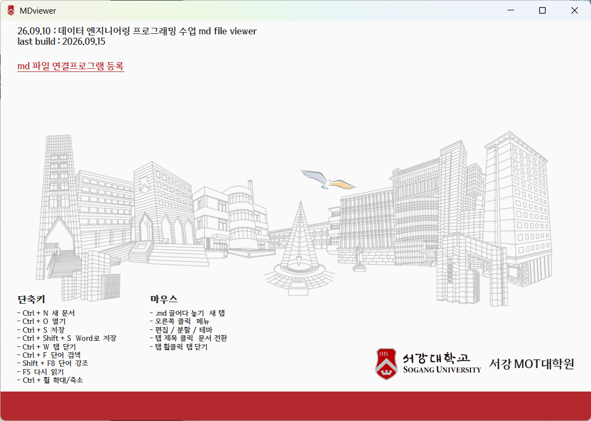
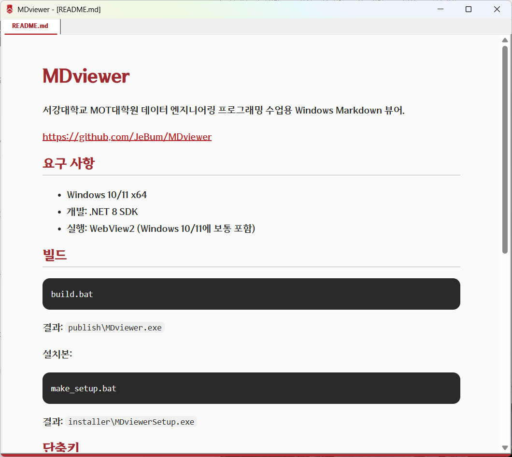
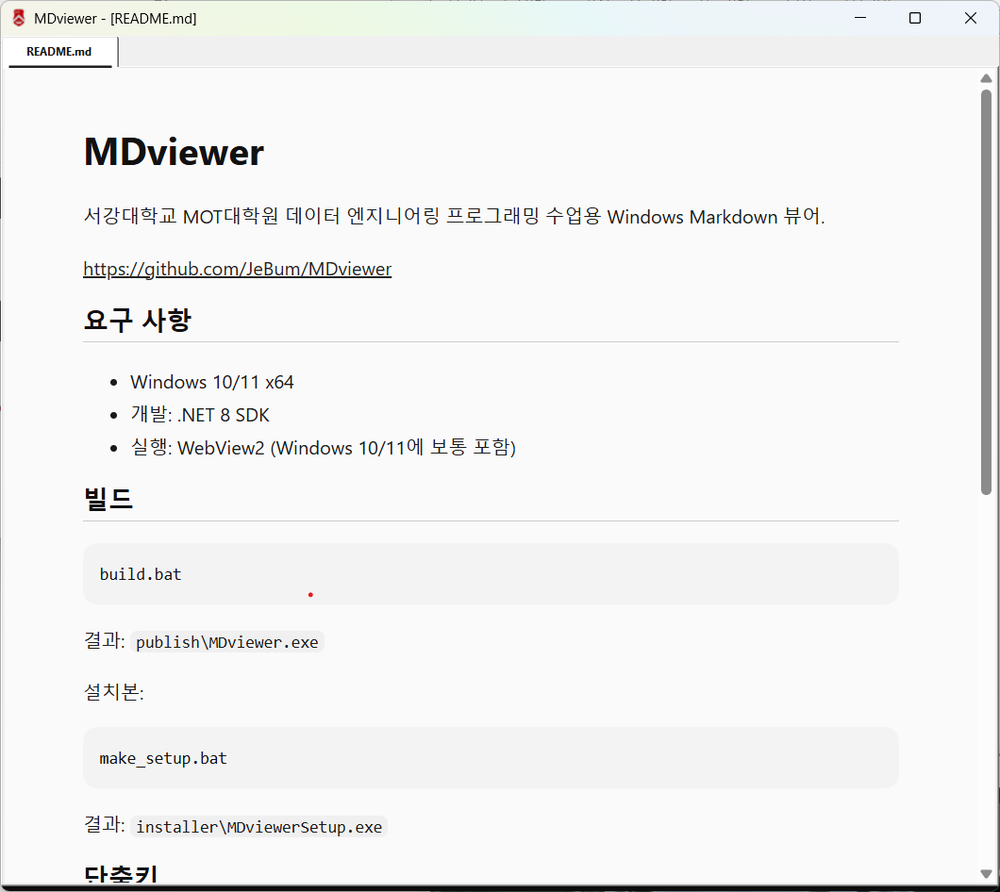
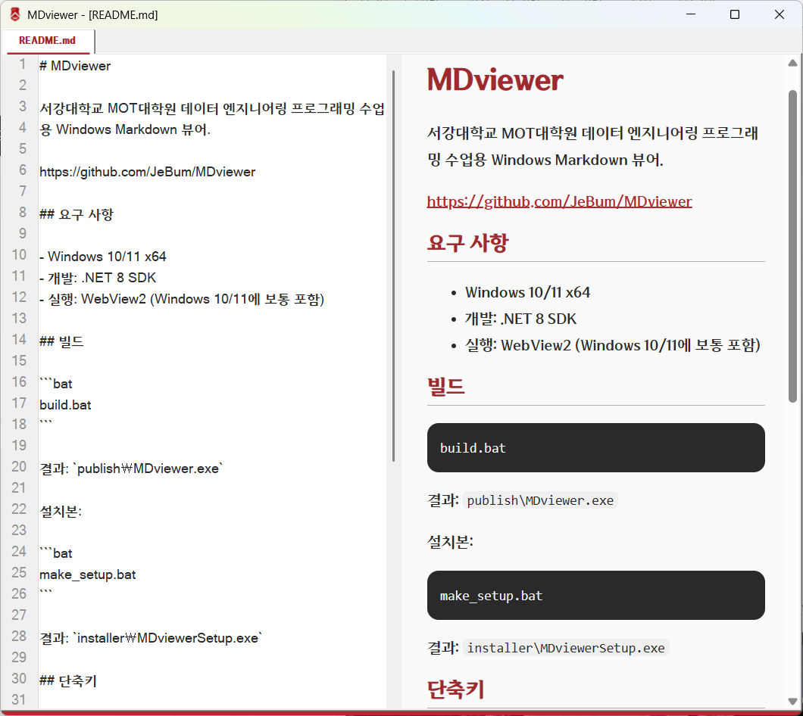

# MDviewer

서강대학교 MOT대학원 데이터 엔지니어링 프로그래밍 수업용 Windows Markdown 뷰어 & 편집 프로그램

https://github.com/JeBum/MDviewer

## 스크린샷

### 홈



### 서강 테마



### 알바트로스 테마



### 편집 모드



## 요구 사항

- Windows 10/11 x64
- 개발: .NET 8 SDK
- 실행: WebView2 (Windows 10/11에 보통 포함)

## 빌드

```bat
build.bat
```

결과: `publish\MDviewer.exe`

설치본:

```bat
make_setup.bat
```

결과: `installer\MDviewerSetup.exe`

## 단축키 (Keyboard Shortcuts)

| 단축키 | 동작 |
|---|---|
| `Ctrl + N` | 새 문서 |
| `Ctrl + O` | 열기 |
| `Ctrl + S` | 저장 |
| `Ctrl + Shift + S` | Word로 저장 (.docx) |
| `Ctrl + W` | 탭 닫기 |
| `Ctrl + F` | 단어 검색 |
| `Shift + F8` | 선택 단어 강조 (강조 키워드 등록) |
| `F5` | 다시 읽기 (새로고침) |
| `Ctrl + 휠` | 확대 / 축소 |

## 마우스 조작 (Mouse Actions)

| 마우스 조작 | 동작 |
|---|---|
| `.md` 파일 끌어다 놓기 | 새 탭으로 문서 열기 |
| 오른쪽 클릭 | 메뉴 (컨텍스트 메뉴 호출) |
| 탭 제목 클릭 | 해당 문서로 전환 |
| 탭 휠클릭 (가운데 버튼) | 해당 탭 닫기 |

## 우클릭 메뉴 (Context Menu)

- **New**: 새 문서 생성
- **Open**: 파일 열기
- **Save**: 현재 문서 저장
- **Word로 저장**: `.docx` 파일로 변환 저장
- **닫기**: 현재 활성 탭 닫기
- **전체 닫기**: 모든 탭 닫기
- **다른 문서 닫기**: 현재 탭 외 나머지 탭 닫기
- **검색 (Ctrl+F)**: 단어 검색
- **강조 키워드 (Shift+F8)**: 탭 하단 강조 키워드 입력창 표시/숨김
- **편집 모드**: 소스 편집기 활성화/비활성화
- **세로 분할**: 편집기와 미리보기를 좌우로 분할
- **가로 분할**: 편집기와 미리보기를 상하로 분할
- **서강 테마 / 알바트로스 테마**: 테마 전환

## 주요 기능

- **선택 단어 강조 (Shift + F8)**: 탭 하단의 `강조키워드:` 입력란에 등록된 키워드를 문서 전체에서 선명한 형광 노란색으로 일괄 강조 표시합니다. 선택된 단어를 `Shift + F8`로 즉시 추가할 수 있으며, 평상시에는 숨겨져 있고 우클릭 메뉴 또는 단축키 사용 시 입력창이 나타납니다. 띄어쓰기로 단어를 추가/삭제하여 실시간으로 강조를 제어할 수 있습니다.
- **단일 인스턴스 (탭 열기)**: Windows 탐색기에서 `.md` 파일을 더블 클릭하거나 연결 프로그램으로 실행할 때 새 창이 계속 뜨지 않고 기존 실행 창의 새 탭으로 열립니다.
- **외부 웹 브라우저 연동**: 문서 내 `http://`, `https://`, `mailto:` 링크 클릭 시 시스템 기본 웹 브라우저에서 안전하게 열립니다.
- **연결 프로그램 등록**: 홈 화면의 `md 파일 연결프로그램 등록`을 통해 `.md` 파일의 기본 앱 등록을 쉽게 설정할 수 있습니다.

## 테마

- **서강 테마**: 서강대학교 시그니처 스타일
- **알바트로스 테마**: 모던 미니멀 스타일
