# Mermaid 화려한 종합 테스트

Mermaid 공식 예제의 스타일, 분기, 주석, 다중 레이아웃, 도형, 연결선을 반영한 종합 샘플입니다.
모든 다이어그램은 외부 서버 없이 내장 Mermaid 렌더러로 표시됩니다.

## Flowchart — UART 진단 파이프라인

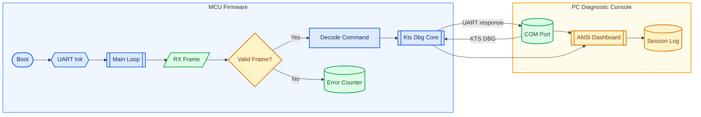

## Sequence diagram — 실시간 ANSI 대시보드

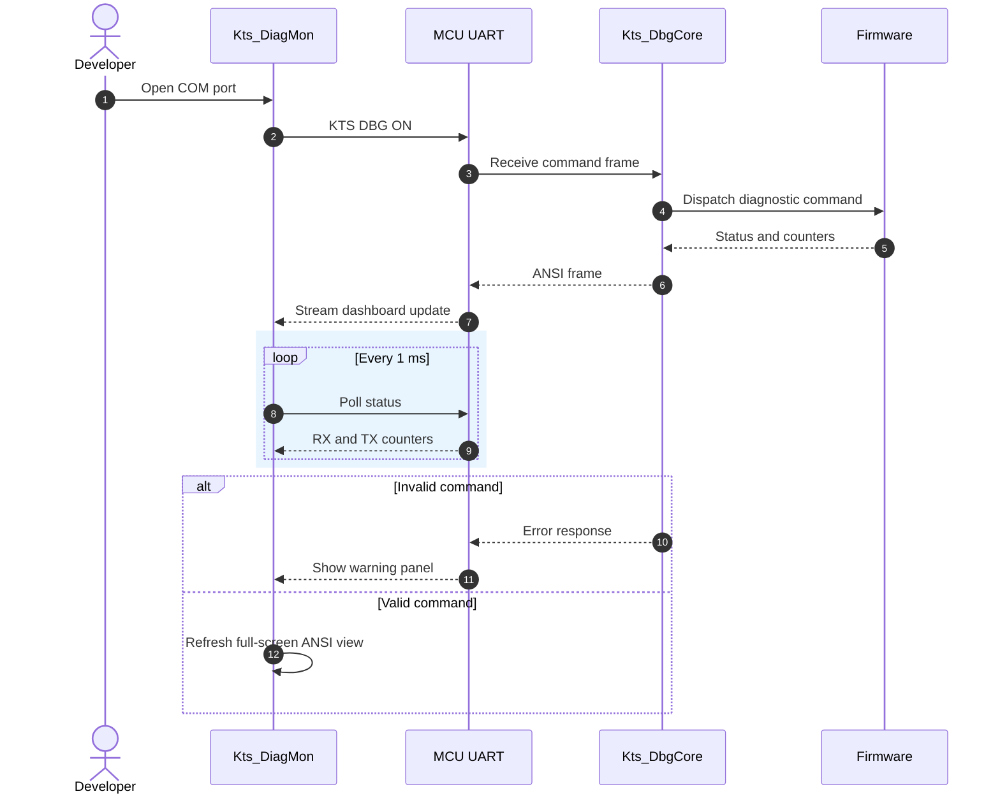

## Class diagram — 진단 모듈 구조

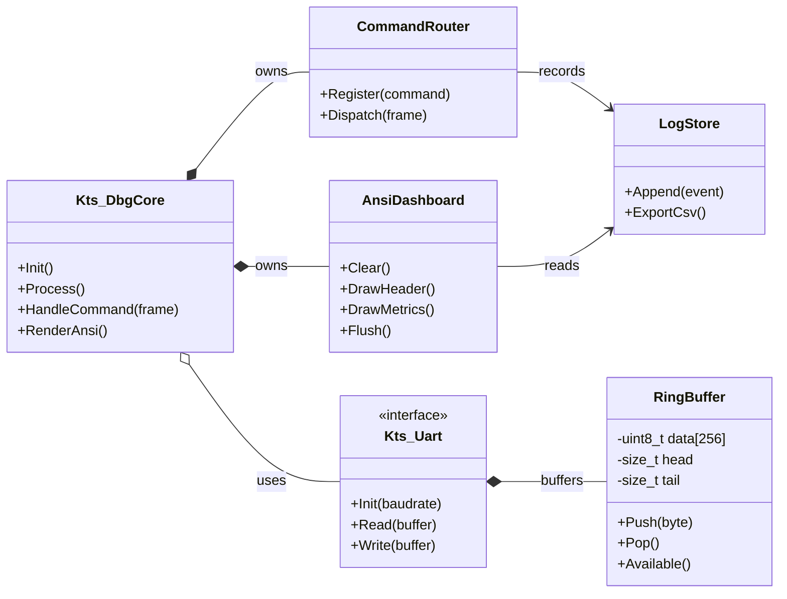

## State diagram — 진단 모드 상태

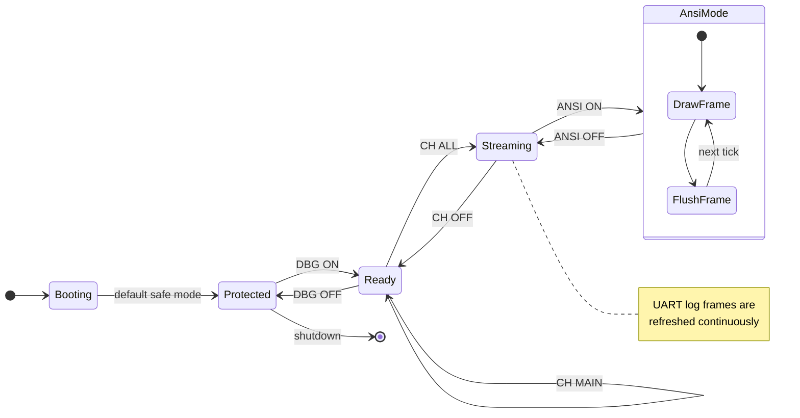

## Entity relationship diagram — UART 이벤트 모델

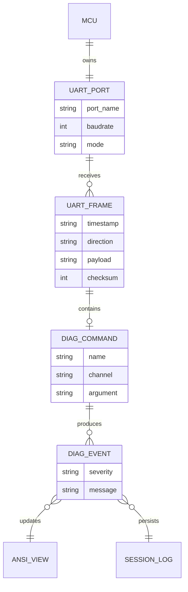

## Gantt chart — 포팅 및 검증 일정

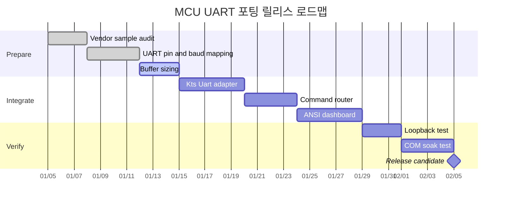

## Pie chart — UART 트래픽 구성

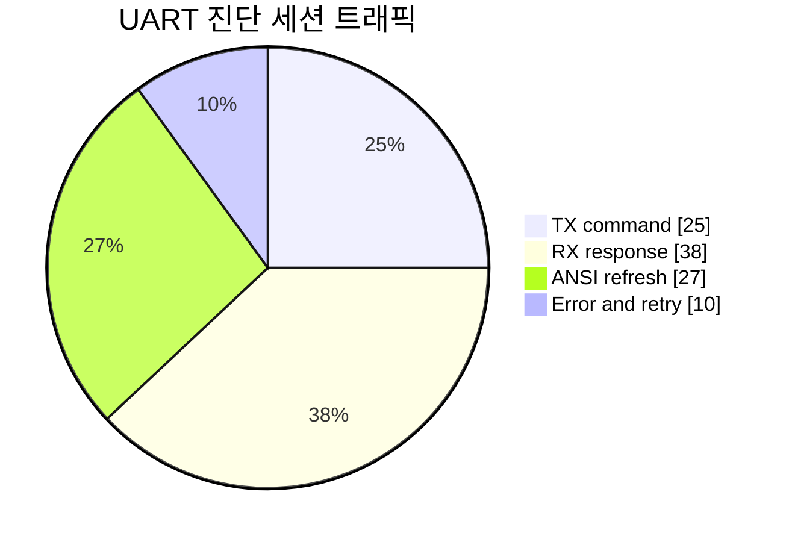

## User journey — 개발자 검증 여정

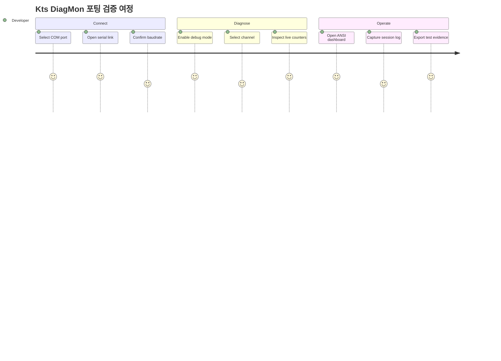

## Git graph — 기능 브랜치 통합

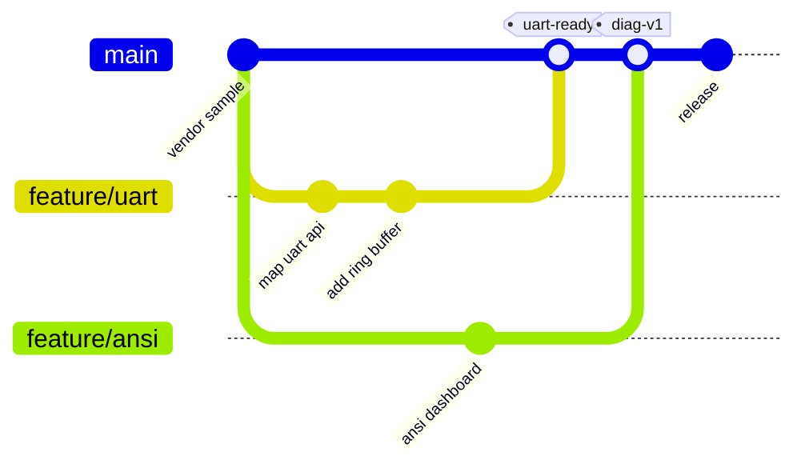

## Requirement diagram — 제품 요구사항 추적

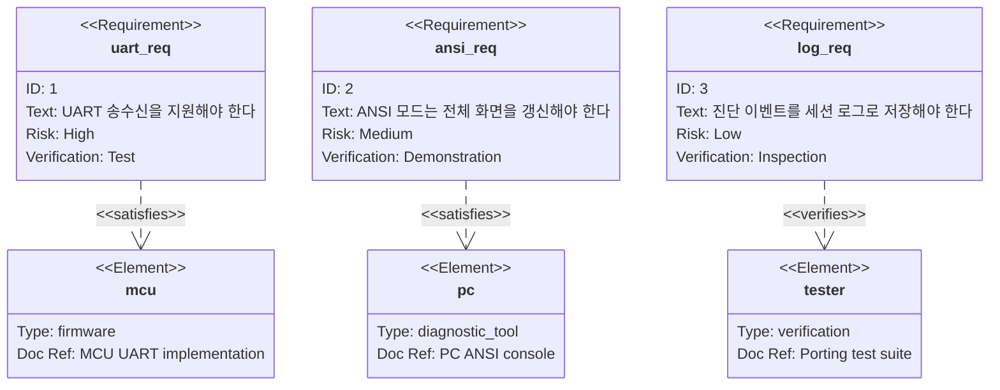

## Mindmap — 시스템 구성 한눈에 보기

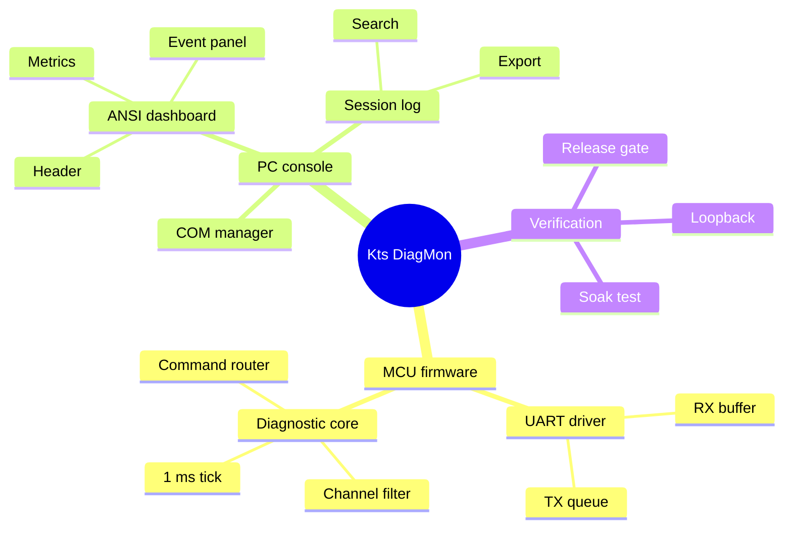

## Timeline — 포팅 릴리스 이정표

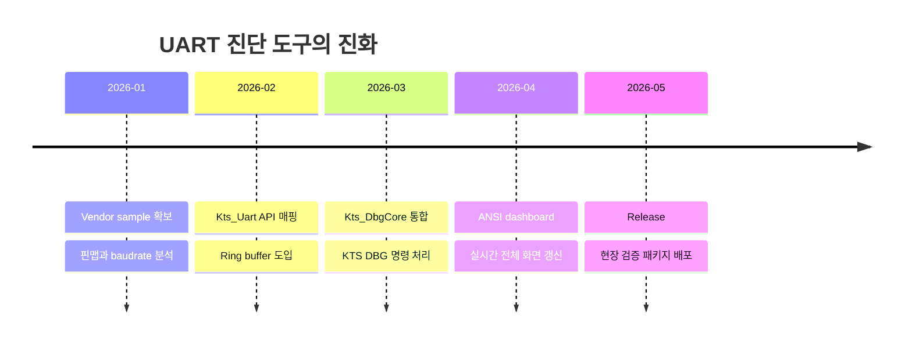

## Quadrant chart — 개발 우선순위

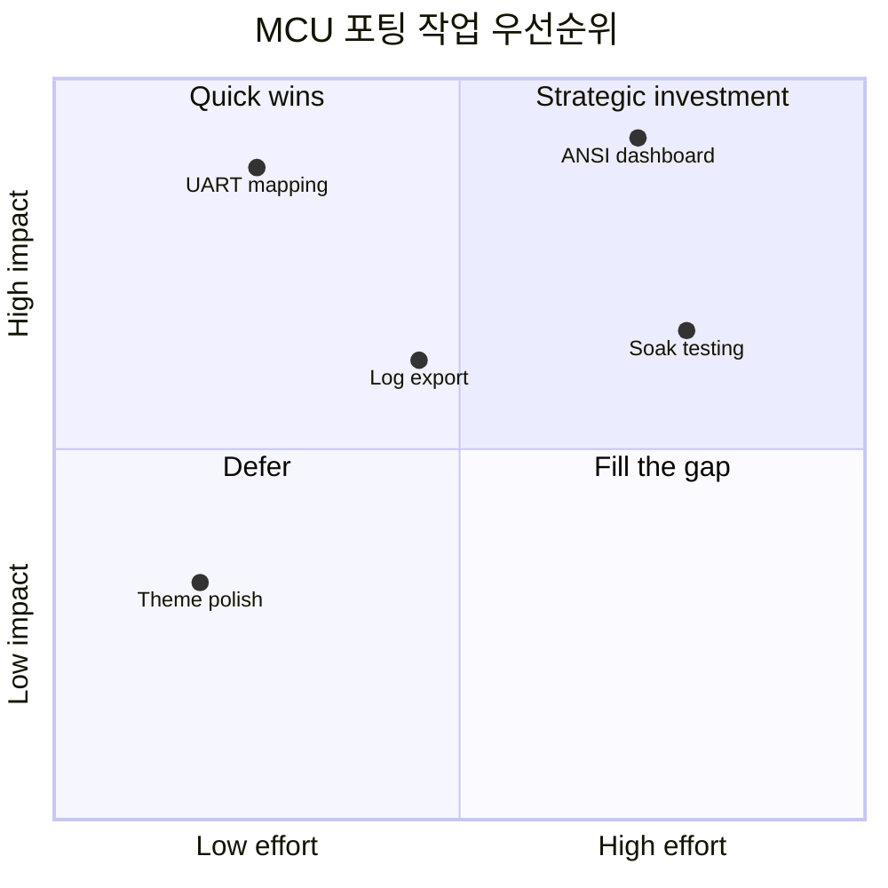

## XY chart — 처리량과 지연시간

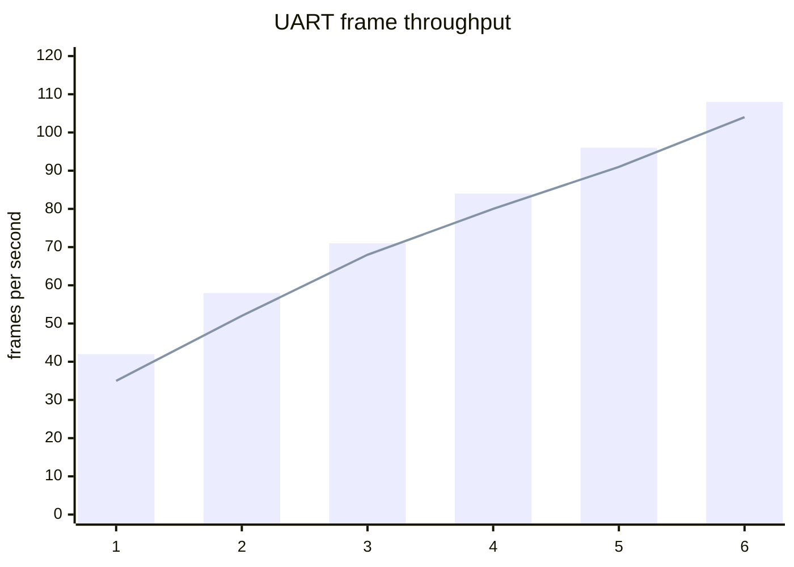

## C4 context — 진단 시스템 컨텍스트

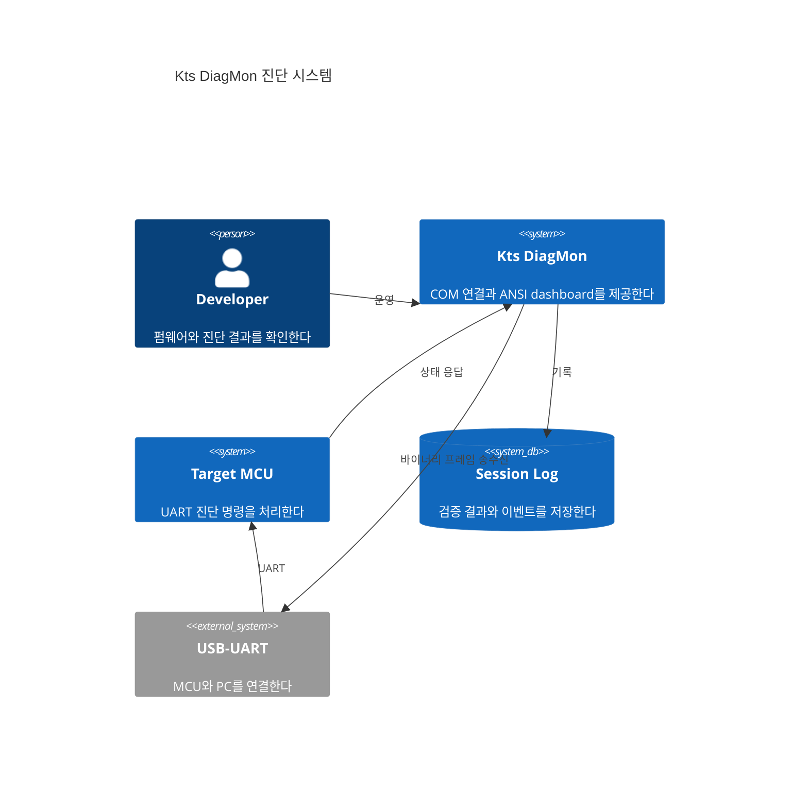

## Sankey diagram — 진단 데이터 흐름

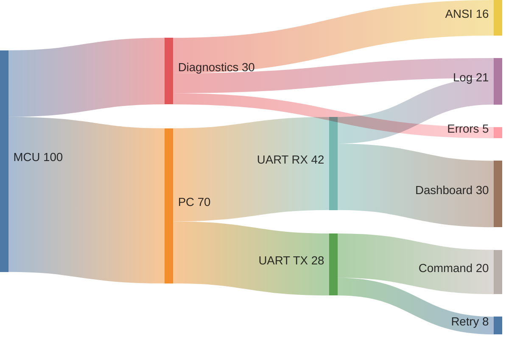

## Block diagram — 공식 예제 스타일의 MCU 진단 아키텍처

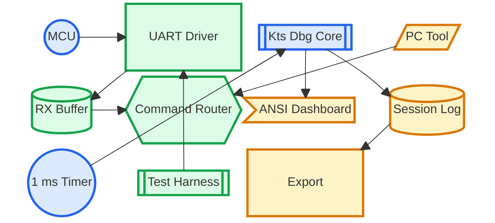
