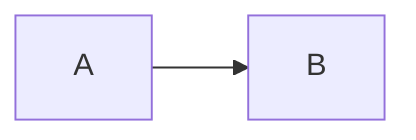

````markdown
# 지식관리 도구 마크업 문법 사전 — 편집기 구현 명세서

> **문서 용도**: 이 문서는 텍스트 편집기(Editor)에 지식관리 기능을 추가하기 위한 AI 코딩 프롬프트로 사용된다.
> **사용 방법**: 각 문법 항목의 "편집 모드 구현 명세"를 그대로 기능 요구사항으로 전달한다.
> **정렬 기준**: 사용 도구 수와 커뮤니티 채택도 기준 인기순

---

## 목차

1. [Markdown / GFM](#1-markdown--gfm-)
2. [위키링크 Wiki Link](#2-위키링크-wiki-link-)
3. [해시태그 Tag](#3-해시태그-tag-)
4. [태스크 Task / Checkbox](#4-태스크-task--checkbox-)
5. [프론트매터 Frontmatter / YAML](#5-프론트매터-frontmatter--yaml-)
6. [임베드 Embed](#6-임베드-embed-)
7. [콜아웃 Callout](#7-콜아웃-callout-)
8. [블록 참조 Block Reference](#8-블록-참조-block-reference-)
9. [수식 LaTeX / Math](#9-수식-latex--math-)
10. [하이라이트 Highlight](#10-하이라이트-highlight-)
11. [각주 Footnote](#11-각주-footnote-)
12. [머메이드 다이어그램 Mermaid](#12-머메이드-다이어그램-mermaid-)
13. [인라인 필드 Inline Field](#13-인라인-필드-inline-field-)
14. [주석 Comment](#14-주석-comment-)
15. [쿼리 블록 Query Block](#15-쿼리-블록-query-block-)

---

## 1. Markdown / GFM ★★★★★

**사용 도구**: Obsidian, Notion(부분), Joplin, Bear, Typora, GitHub, VS Code

**문법 예시**:

```markdown
# H1 ~ ###### H6
**굵게**, *기울임*, ~~취소선~~, `인라인 코드`
- 리스트, 1. 순서 리스트
> 인용문
```코드 블록```
[링크](https://url), 
| 표 | 셀 |
```

### 편집 모드 구현 명세

- **라이브 프리뷰**: 커서가 있는 라인은 원본 문법을, 나머지 라인은 렌더링된 결과를 표시 (WYSIWYG 하이브리드)
- **자동 리스트 이어가기**: 리스트 항목에서 `Enter` 입력 시 다음 항목 마커(`- `, `1. `) 자동 삽입, 빈 항목에서 `Enter` 시 마커 삭제 후 리스트 탈출
- **들여쓰기**: `Tab`/`Shift+Tab`으로 리스트 항목 들여쓰기/내어쓰기, 마커 유지
- **서식 단축키**: `Ctrl+B`(굵게), `Ctrl+I`(기울임), `Ctrl+K`(링크) — 선택 텍스트가 있으면 감싸기, 없으면 플레이스홀더 삽입
- **마크다운 붙여넣기**: HTML 클립보드 자동 변환 옵션

---

## 2. 위키링크 Wiki Link ★★★★★

**사용 도구**: Obsidian, Roam Research, Logseq, Anytype, Tana

**문법 예시**:

```
[[문서명]]
[[문서명|표시 텍스트]]
[[문서명#소제목]]  (섹션 앵커)
```

### 편집 모드 구현 명세

- **트리거**: `[[` 입력 즉시 자동완성 팝업 활성화
- **팝업 동작**: 문서 제목 목록을 퍼지(fuzzy) 검색으로 필터링, `↑↓` 탐색, `Enter`/`Tab` 선택, `Esc` 닫기
- **미해결 링크(Unresolved Link)**: 존재하지 않는 문서명 입력 시 → 회색/점선 스타일로 표시, 클릭 시 해당 이름으로 새 문서 생성
- **별칭 파싱**: `|` 입력 시 팝업의 검색 대상은 계속 문서명, 파이프 뒤는 표시 텍스트로 처리
- **렌더링**: 클릭 가능한 링크 스타일, 호버 시 대상 문서 미리보기 팝업(호버 프리뷰)
- **백링크**: 문서 저장 시 역방향 링크 인덱스 갱신, 사이드바 백링크 패널 제공

---

## 3. 해시태그 Tag ★★★★☆

**사용 도구**: Bear, Obsidian, Roam, Logseq, Notion

**문법 예시**:

```
#태그  #중첩/태그  #태그_123
```

### 편집 모드 구현 명세

- **트리거**: 공백/줄 시작 직후 `#` 입력 시 태그 자동완성 팝업 (기존 태그 목록 표시)
- **파싱 규칙**: `#` 뒤에 공백 없는 문자열, 한글/영문/숫자/`_`/`-`/`/` 허용, 문장부호에서 종료
- **제외 규칙**: 헤더 `# `, 코드 블록 내부, URL 내부의 `#`는 태그로 파싱하지 않음
- **렌더링**: 파란색/보라색 배지 스타일, 클릭 시 해당 태그 검색 결과로 이동
- **중첩 태그**: `/` 계층 구조 인식 → 태그 패널에서 트리 뷰로 표시

---

## 4. 태스크 Task / Checkbox ★★★★☆

**사용 도구**: GitHub, Obsidian, Todoist 스타일 앱 전반, Logseq

**문법 예시**:

```
- [ ] 미완료
- [x] 완료
- [/] 진행 중 (확장)
```

### 편집 모드 구현 명세

- **렌더링**: `- [ ]`를 클릭 가능한 체크박스 UI로 변환, 클릭 시 `[ ]`↔`[x]` 토글
- **스타일 연동**: 체크 시 텍스트에 취소선 + 흐린 색 자동 적용
- **완료 날짜**: 옵션으로 `✅ 2024-01-15` 자동 삽입
- **하위 태스크**: 들여쓰기로 중첩 지원, 부모 체크 시 자식 일괄 처리 옵션
- **들여쓰기 정규화**: `[` 사이 공백 자동 정리

---

## 5. 프론트매터 Frontmatter / YAML ★★★★☆

**사용 도구**: Obsidian, Jekyll, Hugo, 정적 사이트 생성기 전반

**문법 예시**:

```yaml
---
title: 문서 제목
tags: [ai, notes]
date: 2024-01-15
status: draft
---
```

### 편집 모드 구현 명세

- **프로퍼티 패널**: `---` 블록을 소스 코드 대신 **키-값 폼 UI**로 렌더링 (Notion 속성 스타일)
- **키 자동완성**: 기존 문서들에서 수집한 키 목록 기반 추천
- **타입별 입력기**: `date` → 날짜 선택기, `tags` → 태그 칩 입력, boolean → 토글
- **유효성 검사**: YAML 파싱 오류 시 인라인 에러 표시 (줄 번호와 함께)
- **숨김 옵션**: 패널 접기/펼치기 토글

---

## 6. 임베드 Embed ★★★★☆

**사용 도구**: Obsidian (`![[...]]`), Logseq/Roam (`{{embed ...}}`)

**문법 예시**:

```
![[이미지.png]]
![[다른문서]]          → 문서 전체 삽입
![[이미지.png|300]]    → 크기 지정(px)
![[문서명#소제목]]     → 섹션만 삽입
```

### 편집 모드 구현 명세

- **트리거**: `![` 입력 시 위키링크 자동완성 팝업 재사용 (파일 + 문서 통합 검색)
- **렌더링**: 이미지 → 실제 표시, 문서 → 중첩 렌더링(재귀 제한 필수, 순환 참조 감지)
- **리사이즈**: 렌더링된 이미지 모서리 드래그 시 `|너비` 값 자동 수정
- **에러 상태**: 파일 없음 시 깨진 링크 아이콘 + 생성 제안

---

## 7. 콜아웃 Callout ★★★★☆

**사용 도구**: Obsidian, Logseq, GitHub(유사 기능 `> [!NOTE]`)

**문법 예시**:

```
> [!note] 제목
> 내용

> [!warning]- 접힌 콜아웃
```

### 편집 모드 구현 명세

- **트리거**: `> [!` 입력 시 타입 목록 팝업: `note, info, tip, success, question, warning, danger, error, quote, example`
- **렌더링**: 타입별 아이콘 + 좌측 테두리 색상 카드, 인용문과 시각적 구분
- **접기**: 타입 뒤 `-`(기본 접힘) / `+`(기본 펼침) → 렌더링 시 ▼ 토글 버튼, 상태 저장
- **컨텍스트 메뉴**: 렌더링된 콜아웃 우클릭 → 타입 변경, 제목 편집
- **중첩**: 인용문 안의 리스트/코드블록 정상 렌더링

---

## 8. 블록 참조 Block Reference ★★★☆☆

**사용 도구**: Roam Research (`((id))`), Logseq, Obsidian (`^block-id`)

**문법 예시**:

```
이것은 블록입니다. ^abc123
((abc123))          → 블록 참조
!((abc123))         → 블록 임베드 (Logseq)
```

### 편집 모드 구현 명세

- **트리거**: `((` 입력 시 블록 단위 검색 팝업 (문서가 아닌 문단/블록 단위)
- **자동 ID 생성**: 블록 끝에 드래그 핸들 우클릭 → "블록 ID 복사" 시 `^랜덤ID` 자동 부여
- **렌더링**: 참조된 블록 내용을 인라인/중첩 표시, 출처 문서명 배지 표시
- **호버 프리뷰**: 원본 블록의 컨텍스트(앞뒤 블록) 미리보기
- **백링크 추적**: 블록 삭제 시 참조 끊김 경고 표시

---

## 9. 수식 LaTeX / Math ★★★☆☆

**사용 도구**: Obsidian, Joplin, Notion, HackMD

**문법 예시**:

```
$E = mc^2$        → 인라인 수식
$$\int_0^1 f(x)dx$$  → 블록 수식
```

### 편집 모드 구현 명세

- **트리거**: `$` 입력 시 짝 `$` 감지 → 라이브 렌더링 모드 진입
- **편집 UX**: 커서 진입 시 원본 LaTeX 표시, 커서 이탈 시 렌더링 결과 표시 (KaTeX 권장 — MathJax보다 빠름)
- **에러 처리**: 파싱 실패 시 빨간 원본 텍스트 유지 (렌더링 실패로 사라지지 않게)
- **블록 수식**: `$$` 전용 줄 → 중앙 정렬 렌더링, 번호 매기기 옵션

---

## 10. 하이라이트 Highlight ★★★☆☆

**사용 도구**: Obsidian, Bear, Marked.js 생태계

**문법 예시**:

```
==강조 텍스트==
```

### 편집 모드 구현 명세

- **렌더링**: 노란 배경 (`<mark>` 태그)
- **단축키**: 텍스트 선택 후 `Ctrl+Shift+H` → `==선택==` 감싸기
- **중첩**: `**==굵은 하이라이트==**` 등 다른 인라인 문법과 조합 허용

---

## 11. 각주 Footnote ★★★☆☆

**사용 도구**: GFM 확장 지원 도구 전반, Obsidian

**문법 예시**:

```
본문 텍스트[^1]

[^1]: 각주 내용
```

### 편집 모드 구현 명세

- **렌더링**: 윗첨자 숫자 링크, 클릭 시 각주 정의로 스크롤
- **호버 팝업**: 본문의 `[^1]`에 마우스 올리면 각주 내용 플로팅 표시
- **자동 번호 관리**: 각주 삽입/삭제 시 문서 전체 번호 재정렬
- **역방향 링크**: 각주 정의의 ↩ 버튼으로 본문 복귀

---

## 12. 머메이드 다이어그램 Mermaid ★★☆☆☆

**사용 도구**: Obsidian, GitLab, GitHub(부분)

**문법 예시**:

````markdown

````

### 편집 모드 구현 명세

- **분할 미리보기**: 코드 좌측 / 다이어그램 우측 실시간 동기 렌더링 (디바운스 300ms)
- **에러 표시**: 문법 오류 시 해당 라인 하이라이트
- **툴바**: 다이어그램 타입 선택 템플릿 삽입 (flowchart, sequence, gantt...)

---

## 13. 인라인 필드 Inline Field ★★☆☆☆

**사용 도구**: Obsidian(Dataview 플러그인), Logseq

**문법 예시**:

```
상태:: 진행중
우선순위:: 높음
[키:: 값]   (괄호 형태)
```

### 편집 모드 구현 명세

- **렌더링**: `키::값`을 배지/칩 형태로 스타일링
- **자동완성**: 기존 키 목록 기반 추천 팝업
- **인덱싱**: 문서 저장 시 키-값을 메타데이터 인덱스에 반영 → 쿼리/테이블 뷰에서 사용 가능

---

## 14. 주석 Comment ★★☆☆☆

**사용 도구**: Obsidian (`%%...%%`), HTML 주석 `<!--...-->`

**문법 예시**:

```
%%편집자에게만 보이는 메모%%
```

### 편집 모드 구현 명세

- **렌더링 모드**: 완전 숨김 (기본) 또는 회색 흐림 표시(설정 옵션)
- **편집 모드**: 흐린 회색 스타일로 시각적 구분
- **토글 단축키**: 전체 문서 주석 표시/숨김 전환

---

## 15. 쿼리 블록 Query Block ★☆☆☆☆

**사용 도구**: Obsidian(Dataview), Logseq 쿼리, Tana

**문법 예시**:

````markdown
```dataview
TABLE status FROM #project WHERE status != "done"
```
````

### 편집 모드 구현 명세

- **렌더링**: 코드 블록을 쿼리 결과 테이블로 변환, 상단에 "새로고침" 버튼
- **편집 전환**: 결과 영역 클릭 → 원본 쿼리 코드 편집 모드 진입
- **자동완성**: 필드명/태그/폴더 경로 추천

---

## 구현 우선순위 요약

| 단계 | 구현 대상 | 핵심 기능 |
|------|----------|----------|
| P0 | Markdown, Wiki Link | 라이브 프리뷰, `[[` 자동완성, 백링크 인덱스 |
| P1 | Tag, Task, Frontmatter | `#` 팝업, 체크박스 토글, 프로퍼티 패널 |
| P2 | Embed, Callout, Highlight | 임베드 렌더링, 콜아웃 타입 팝업 |
| P3 | Block Ref, Math, Footnote | 블록 ID 시스템, KaTeX 통합 |
| P4 | Mermaid, Inline Field, Query | 외부 라이브러리 연동, 쿼리 엔진 |

---

## AI 프롬프트 사용 가이드

이 문서를 AI 코딩 프롬프트로 사용할 때 권장 형식:

```
너는 지식관리 편집기를 개발하는 시니어 개발자다.
아래 명세서의 [N번 문법] 항목을 구현하라.
요구사항:
- 편집 모드 명세의 모든 항목 충족
- 기술 스택: (예: React + CodeMirror 6)
- 출력물: (예: 구현 코드 + 테스트 케이스)
```
````

**저장 방법**: 위 코드 블록 내용 전체를 복사 → `knowledge-markup-spec.md`로 저장하면 됩니다. 문서 하단의 "AI 프롬프트 사용 가이드"는 실제 AI에게 명세를 전달할 때의 활용 예시이니, 순수 명세서로만 쓰고 싶다면 그 부분은 삭제해도 됩니다.